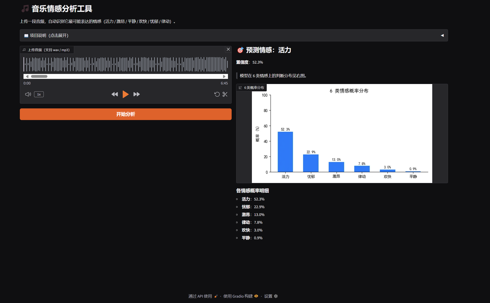
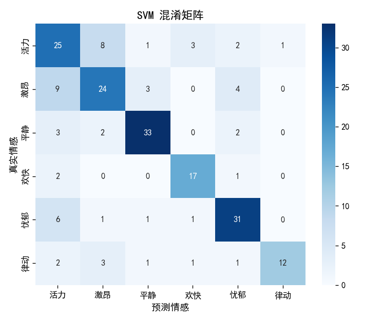

# 🎵 MusicEmotion AI · 音乐情感分析工具


> 基于 **GTZAN 数据集** 与 **SVM** 的音乐情感分析工具：上传一段音频，自动提取 **37 维声学特征**，预测 **6 类情感标签**（活力 / 激昂 / 平静 / 欢快 / 忧郁 / 律动）。

---

## 📌 项目简介

MusicEmotion AI 是一个面向简历 / 开源社区的端到端机器学习小项目。它把「音频信号处理 → 特征工程 → 传统机器学习分类 → 可交互 Web 界面」整条链路跑通：

- 输入：用户上传 `wav` / `mp3` 音频；
- 处理：用 `librosa` 提取 **37 维声学特征**（MFCC、频谱质心 / 滚降、过零率、RMS 能量、色度、BPM、频谱对比度等）；
- 输出：SVM 分类器给出 **Top-1 中文情感标签 + 6 类概率分布**。

**为什么不用深度学习？** 项目定位是「可解释、可复现、零 GPU 也能跑」的轻量方案，用 `scikit-learn` 的 SVM / RandomForest / KNN 即可在普通笔记本上完成训练与推理。

---

## 🖼️ 效果展示

| Gradio 交互界面 | SVM 混淆矩阵 |
|---|---|
|  |  |

> 左图为上传音频后实时预测的 Web 界面（含 6 类概率柱状图）；右图为最终选用的 SVM 模型在测试集上的混淆矩阵，是面试中最常被追问的「误差分析」素材。

---

## ✨ 核心特性

- **零配置音频解析**：内置 `imageio-ffmpeg`（自带静态 ffmpeg 二进制），`librosa` 读 `mp3` 开箱即用，无需手动安装系统级 ffmpeg。
- **健壮的异常处理**：精准捕获 4 类业务异常——文件不存在、格式不支持（仅 `wav`/`mp3`）、音频损坏、特征维度不匹配，**不崩服务**，全部转为友好提示。
- **诚实的弱监督声明**：明确说明 GTZAN 只有曲风标签、本项目用「曲风→情感」规则映射构造标签，模型学到的主要是曲风声学差异（详见下方「数据集与弱监督声明」）。
- **特征可解释性强**：通过 ANOVA F 值与随机森林特征重要性双重分析，定位出「频谱对比度」才是区分情感的核心特征，而非直觉中的 BPM。

---

## 🏗️ 技术架构

```
音频文件 (wav/mp3)
      │
      ▼
[librosa 特征提取]  ─── 37 维声学特征（每维取整首均值）
      │                 MFCC×13 / centroid / rolloff / zcr / rms
      │                 chroma×12 / tempo / spectral_contrast×7
      ▼
[StandardScaler 标准化]  ── 拟合于训练集，推理时复用同一 scaler
      │
      ▼
[SVM 分类器]  ─── kernel='rbf', C=1.0, probability=True
      │             输出 6 类情感标签 + 各类概率
      ▼
[Gradio 交互界面]  ─── 上传 → 实时预测 → Top-1 标签 + 概率柱状图
```

| 模块 | 技术选型 | 说明 |
|------|----------|------|
| 特征提取 | `librosa 0.10.2` | 37 维声学特征，每维取整曲均值 |
| 分类模型 | `scikit-learn` SVM | 经 RandomForest / KNN 对比，SVM 综合最优 |
| 标准化 | `StandardScaler` | 为后续对比 SVM / 其它线性模型统一接口 |
| 界面 | `Gradio 5.50` | 纯 Python 写可交互 Web 页，零前端经验友好 |

---

## 📊 模型指标（SVM，最终选用）

| 指标 | 数值 |
|------|------|
| **Macro-F1** | **0.721** |
| **Accuracy** | **0.710** |
| **Precision (macro)** | 0.744 |
| **Recall (macro)** | 0.713 |
| **5 折交叉验证** | **0.721 ± 0.022** |

> 在 6 分类、标签由「曲风硬映射」得到的设定下，Macro-F1 落在 **60%~75%** 是健康区间——这反映了「模型学的是曲风声学差异、而非绝对主观情感」的真实天花板，而非模型缺陷。与 RandomForest（F1=0.707）、KNN（F1=0.651）对比后选用 SVM。

---

## 🚀 快速开始

```bash
# 1) 创建并激活虚拟环境（推荐 Python 3.11 / 3.13）
python -m venv .venv
.venv\Scripts\activate          # Windows
# source .venv/bin/activate     # macOS / Linux

# 2) 安装依赖（国内建议清华镜像）
pip install -r requirements.txt -i https://pypi.tuna.tsinghua.edu.cn/simple

# 3) 启动交互界面
python app.py
# 浏览器打开 http://127.0.0.1:7860
```

**仅做单文件预测（不启动界面）：**

```bash
python scripts/predict.py path/to/your_audio.wav
# 输出：predicted_emotion / confidence / 6 类概率分布
```

**从零复现（数据 → 特征 → 训练）：**

```bash
python scripts/download_gtzan.py          # 下载并解压 GTZAN 到 data/genres_original/
python scripts/verify_dataset.py          # 校验数据集完整性
python scripts/extract_features.py         # 提取 37 维特征 → data/features.csv
python scripts/add_emotion_labels.py       # 曲风→情感映射 → data/features_with_emotion.csv
python scripts/train_model.py              # 训练三模型 → models/*.joblib
```

---

## 📁 目录结构

```
MusicEmotion-AI/
├── app.py                      # Gradio 交互界面入口
├── requirements.txt            # 依赖清单（版本已锁定，便于复现）
├── README.md
├── DEPLOYMENT.md               # GitHub 托管 + Hugging Face Spaces 部署指南
├── .gitignore
├── assets/                     # 文档用图（界面截图 / 混淆矩阵）
├── data/                       # 特征表(csv) + 原始音频(已被 .gitignore 排除)
├── models/                     # model.joblib / scaler.joblib / feature_names.json
├── scripts/                    # 数据下载 / 校验 / 特征提取 / 映射 / 训练 / 预测
└── docs/                       # 环境搭建指南 / 数据集选型对比 / 面试话术
```

---

## 📂 数据集与弱监督声明（重要）

本项目使用 **GTZAN** 数据集（10 个曲风 × 100 首 = 1000 段 30s 音频）。**GTZAN 只有曲风标签，没有真实情感标注**，因此本项目按以下规则把曲风映射为情感标签：

| 情感标签 | 映射曲风 | 依据（声学视角） |
|----------|----------|------------------|
| 活力 Energetic | disco, reggae | 高 BPM + 高 RMS + 强律动 |
| 激昂 Intense | rock, metal | 高能量 / 高失真 / 宽频谱 |
| 平静 Calm | classical, jazz | 低能量 / 柔和动态 / 窄频谱 |
| 欢快 Happy | pop | 中快 BPM + 大调明亮 + 中等能量 |
| 忧郁 Melancholic | blues, country | 小调蓝调音阶 / 低能量慢速 |
| 律动 Groovy | hiphop | 中速 + 强低频贝斯 + 突出节奏 |

> ⚠️ **局限性诚实说明**：情感标签是「曲风→情感」的**人工规则映射**（弱监督），模型学到的主要是曲风间的声学差异，而非人类主观情感。这是本项目当前版本的边界，后续可换用带原生情感标注的数据集（如 DEAM）提升语义严谨性。此声明也内置在 `app.py` 的「项目说明」模块中，对使用者透明。

---

## 📄 许可证

本项目以 [MIT License](LICENSE) 开源。数据集 GTZAN 的版权归原始发布方所有，请遵守其使用条款。

## 🙏 引用

- GTZAN Genre Collection — T. Tzanetakis, G. Cook, *Musical genre classification of audio signals* (2002).
- librosa — B. McFee et al., *librosa: Audio and Music Signal Analysis in Python* (2015).
